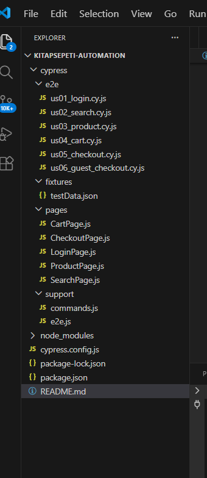

# 📚 Kitapsepeti Automation Project

## 🎯 Projenin Amacı
Bu proje, canlı bir e-ticaret sitesi olan **kitapsepeti.com** üzerinde
temel kullanıcı akışlarının **manuel** ve **otomasyon testleri** ile
doğrulanması amacıyla hazırlanmıştır.

Amaç; kullanıcıların site üzerinde sorunsuz bir alışveriş deneyimi
yaşayabilmesini sağlamak ve kritik e-ticaret senaryolarının doğru
çalıştığını test etmektir.

---

## 🧩 Test Edilen User Story’ler

| ID   | User Story                         | Açıklama |
|------|------------------------------------|----------|
| US01 | Kullanıcı Girişi                   | Kayıtlı kullanıcı olarak sisteme giriş |
| US02 | Ürün Arama ve Listeleme            | Ürün arama, filtreleme ve listeleme |
| US03 | Ürün Detay ve Sepete Ekleme        | Ürün detayına girip sepete ekleme |
| US04 | Sepet Yönetimi                     | Sepette ürün adedi artırma / azaltma |
| US05 | Checkout & Sipariş Adımı           | Adres ve ödeme adımına geçiş |
| US06 | Misafir Olarak Satın Alma          | Üye olmadan satın alma akışı |

---

## 📝 Manuel Test Senaryoları
- Manuel testler **Excel** dosyası üzerinden hazırlanmıştır.
- Her User Story için **pozitif** ve **negatif** senaryolar yazılmıştır.
- Senaryolar **User Story** ve **Acceptance Criteria (AC)** bazlıdır.

---

## ⚙️ Kullanılan Teknolojiler
- **JavaScript**
- **Cypress** (E2E test otomasyonu)
- **Page Object Model (POM)**
- **Node.js & npm**
- **Mocha** (test raporlama altyapısı)

---

## 📁 Proje Yapısı




---

## ▶️ Testleri Çalıştırma

### Cypress Test Runner (UI mod)
```bash
npx cypress open

Headless mod
npx cypress run

📸 Test Çalışma Kanıtları
US03 – Ürün Detaydan Sepete Ekleme

Aşağıdaki ekran görüntüsünde, Cypress testinin başarıyla çalıştığı ve
ürünün sepete eklendiği görülmektedir.


ℹ️ Notlar

Testler canlı sistem üzerinde çalıştırılmıştır.

Gerçek ödeme işlemi tamamlanmamıştır.

Proje eğitim ve test amaçlı hazırlanmıştır.

👩‍💻 Hazırlayan

Zeynep Oğuz
